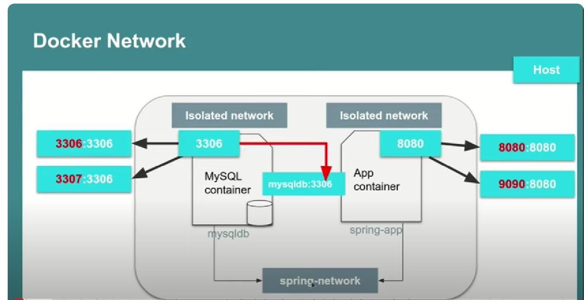

# Dockerized Spring Boot App with Mysql database

## Overview

In this project uses Docker for create two docker container.

- first for database
- second for spring boot application.

Used docker-compose.yml and dockerfile for
created network for communication between host and database.

In the provided docker-compose.yml file, _volumes_ 
are used to save data persistently and re-read it every time the application start.

## Technologies Used

- **Framework:** Spring Boot 3
- **Language:** Java 17
- **Database:** MySQL
- **Database Migration:** Flyway
- **Build Tool:** Maven
- **API Testing:** Postman

Used docker commands:
docker pull mysql
docker-compose up
docker-compose up --build